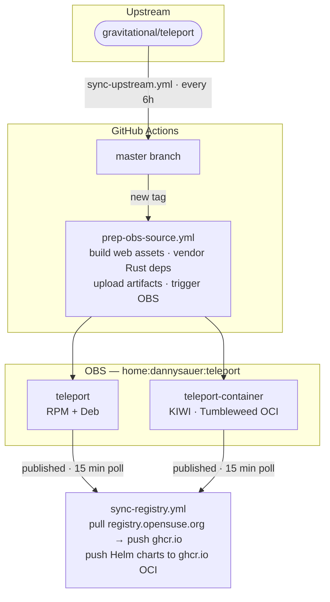

# teleport-fork — autobuild branch

This is the **default branch** of this fork. It contains no Teleport source code — only
the automation that keeps the fork useful.

## Branch layout

| Branch | Contents |
|--------|----------|
| `autobuild` *(this branch)* | Automation workflows, OBS package specs, KIWI container config |
| `master` | Clean mirror of [gravitational/teleport](https://github.com/gravitational/teleport) upstream |

## What gets built automatically

| Artifact | Built where | Published to |
|----------|-------------|--------------|
| RPM (Tumbleweed) | OBS | `registry.opensuse.org` + `download.opensuse.org` |
| Deb (Ubuntu 24.04) | OBS | same OBS repos |
| Container image | OBS (KIWI) | `registry.opensuse.org`, mirrored to `ghcr.io` |
| Helm charts | GitHub Actions | `ghcr.io/dannysauer/charts` (OCI) |

## Automation overview



## Secrets required

| Secret | Used by | Notes |
|--------|---------|-------|
| `OBS_USERNAME` | `prep-obs-source.yml` | OBS account username |
| `OBS_PASSWORD` | `prep-obs-source.yml` | OBS account password or API key |
| `OBS_PROJECT` | `prep-obs-source.yml` | e.g. `home:dannysauer:teleport` |

The `sync-registry.yml` workflow uses only the automatic `GITHUB_TOKEN` — no additional
secrets needed for that direction.

OBS triggers `sync-registry.yml` via `workflow_dispatch` using a fine-grained GitHub PAT
stored in OBS project settings. That PAT has *only* `Actions: write` permission on this
repo — it cannot read code, push packages, or do anything else.

## Patching upstream

The `patches/` directory is reserved for future `.patch` files to apply on top of upstream
before building. See `patches/README.md` for the workflow.

## OBS project layout

```
home:dannysauer:teleport/
├── teleport/              ← RPM spec + Debian packaging
└── teleport-container/    ← KIWI image description
```
