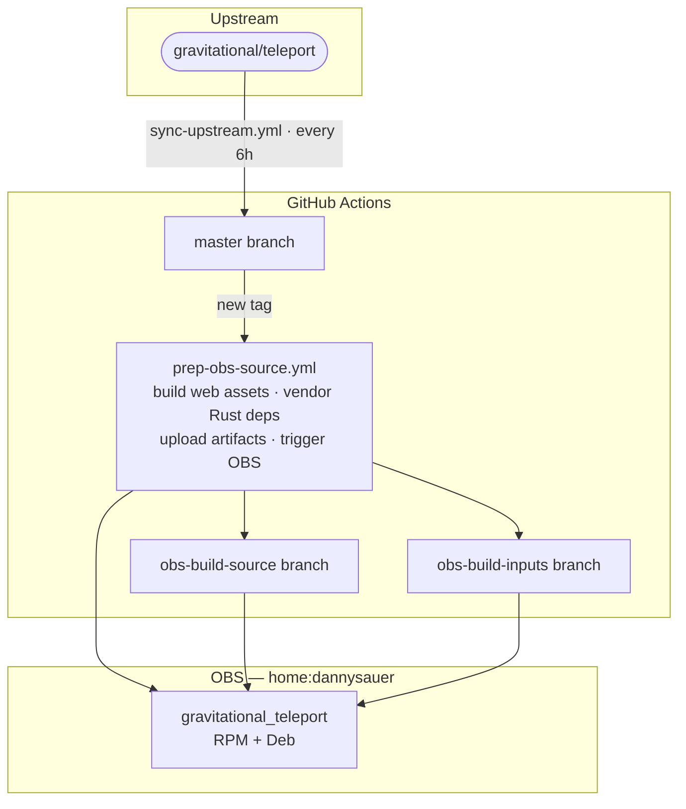

# teleport-fork

[](https://build.opensuse.org/package/show/home:dannysauer/gravitational_teleport)

Community builds of [Teleport](https://github.com/gravitational/teleport),
automatically kept in sync with upstream and published through OBS as RPM and
Deb packages.

> **Source branch:** The `master` branch of this fork is a clean mirror of
> `gravitational/teleport`. This `autobuild` branch contains only the build
> automation. `obs-build-source` and `obs-build-inputs` are force-updated
> operational branches used by OBS.

## Packages

These commands are expected to work after the first successful OBS build has
published `home:dannysauer / gravitational_teleport`.

### openSUSE Tumbleweed (RPM)

```bash
sudo zypper addrepo https://download.opensuse.org/repositories/home:/dannysauer/openSUSE_Tumbleweed/home:dannysauer.repo
sudo zypper refresh
sudo zypper install teleport
```

### Ubuntu 24.04 (Deb)

```bash
curl -fsSL https://download.opensuse.org/repositories/home:/dannysauer/Ubuntu_24.04/Release.key \
  | sudo gpg --dearmor -o /usr/share/keyrings/teleport-obs.gpg
echo "deb [signed-by=/usr/share/keyrings/teleport-obs.gpg] https://download.opensuse.org/repositories/home:/dannysauer/Ubuntu_24.04/ ./" \
  | sudo tee /etc/apt/sources.list.d/teleport.list
sudo apt update
sudo apt install teleport
```

### Container image

OBS builds the container in `home:dannysauer:teleport / teleport-container`
from the RPM published by `home:dannysauer / gravitational_teleport`.

```bash
docker pull registry.opensuse.org/home/dannysauer/teleport/container/dannysauer/teleport:latest
```

### Helm charts

Helm chart publishing is handled by `.github/workflows/sync-registry.yml` when
the OBS image is mirrored to ghcr.io.

## Branch layout

| Branch | Contents |
|--------|----------|
| `autobuild` *(default)* | Build automation, OBS package specs, KIWI container config |
| `master` | Clean mirror of [gravitational/teleport](https://github.com/gravitational/teleport) upstream |
| `obs-build-source` | Force-updated to the upstream tag currently being packaged |
| `obs-build-inputs` | Force-updated to the `autobuild` commit whose patches and packaging match the current assets |

## Automation overview



## Patching upstream

The `patches/` directory holds `.patch` files applied on top of upstream before
building. See [patches/README.md](patches/README.md) for how to add patches.

## Licensing

The Teleport source code is licensed under AGPL-3.0 by Gravitational, Inc.
(with the `api/` package under Apache-2.0).

All files written from scratch in this repository — CI workflows, OBS packaging
specs, container configs, and patch files — are licensed under the
**Apache License, Version 2.0**. See [LICENSE](LICENSE) for details.

## Reproducing this setup

See [SETUP.md](SETUP.md) for instructions on forking this repository and running
your own equivalent build pipeline.
